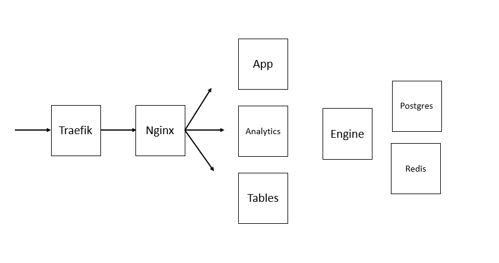
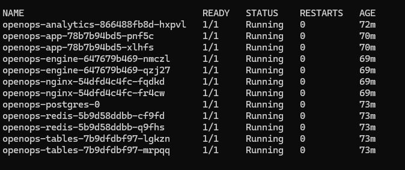

# OpenOps - https://www.openops.com/

There is a chain of dependencies that needs to be respected before you can access the system.\
Wait until previous service is fully up & running before you execute next one.

## My setup





```bash
kubectl create ns openops

# Make sure to change the frontend urls (env_vars.yaml)
# And if you havent notice, I use Traefik as ingress controller.
kubectl apply -f ./common


kubectl apply -f ./postgresql
kubectl apply -f ./redis


# Wait until pg and redis is up & running
kubectl apply -f ./tables


# Wait until tables is up & running
# Analytics will not start until tables returns 200 and pg is running
kubectl apply -f ./analytics


# Wait until tables is up & running
# App will not start until tables returns 200
kubectl apply -f ./app
kubectl apply -f ./engine


# Wait until app is up & running
kubectl apply -f ./nginx


## Login
Url: https://openops.vicrem.se/sign-in

User: admin@vicrem.se
Passwd: see_secret


## Analytics url
Url: https://openops.vicrem.se/openops-analytics/login

User: admin
Passwd: see_secret
```


## ToDo
* PVC for postgres, redis, tables and engine
* Move to cloudnative-pg
* Fix securityContext where its missing
* and probably other stuff..
